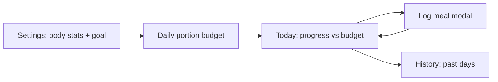

# Handful

A small progressive web app for counting meal portions using your hand as a
reference, based on the [Precision Nutrition](https://www.precisionnutrition.com/) hand-portion method.

## How it works

Handful turns “how much should I eat?” into a daily **portion budget** you can
track meal by meal — without weighing food or counting every gram.

### The portion model

Every meal is counted in four hand-sized units:

| Type | Hand measure | Examples |
|------|--------------|----------|
| Protein | Palm | meat, fish, eggs, legumes |
| Vegetables | Fist | non-starchy veg |
| Carbs | Cupped hand | grains, fruit, tubers |
| Fats | Thumb | oils, nuts, cheese |

Each unit has a calorie estimate that depends on your **hand size** (small,
medium, or big). Medium uses the midpoint of PN’s male/female ranges; small
and big shift values down or up.

### Setup → budget → log → review



1. **Settings** — Enter weight, height, age, activity, and a goal (lose /
   maintain / gain). The app estimates your daily calorie target, then converts
   that into a starting portion budget.
2. **Today** — See calories and portion progress for the current day (or browse
   previous days). Tap **Log meal** to open the logging modal, delete individual
   meals, or clear a whole day.
3. **History** — Browse weeks with prev/next arrows. Each week shows a 7-day
   calorie chart, average portion counts and calories, plus an expandable list
   of days with portion totals.

On first launch you land in **Settings** until a target exists; returning users
with saved data open **Today**.

### Calorie target

The body-stats calculator picks a formula based on what you enter:

- **Katch-McArdle** (lean mass) when body fat % is provided — most accurate.
- **Neutral Mifflin-St Jeor** (average of male/female constants) otherwise —
  no sex field is required.

Daily calories = BMR × activity multiplier × goal multiplier (−20% lose,
±0% maintain, +10% gain).

### Daily portion budget

The calorie target is split into whole portions via `calcGoalPortions()`:

- **Vegetables first** — scaled with body weight (~1 fist per 13.5 kg, minimum
  3). Veggies are always prioritized and never reduced by dynamic recalc.
- **Macro split by goal** — lose skews protein; gain skews carbs; maintain is
  balanced. Ratios are tuned so fat/carb/protein *counts* stay roughly even
  despite different kcal per portion.
- **Protein floor** — at least ~0.056 g protein per kg body weight.
- **Top-up loop** — adds protein, carb, or fat portions until the budget is
  close to the calorie target (whole portions can’t hit every number exactly).

You can fine-tune the budget manually in Settings with +/− on each type. The
**effective daily target** is always the kcal total of your current budget
counts × hand-size values, not the raw calculator output alone.

Changes to budget or hand size are recorded in **target history** so History
can show the correct calorie goal for each past day.

### Logging a meal

From **Today**, tap **Log meal** to open a modal where you count portions with
+/− (or use shortcuts for drinks, snacks, etc.), then save the meal.

Each logged meal stores:

- Timestamp (defaults to today; if you opened the modal while viewing a past
  day on Today, that day is used instead)
- Portion counts and total kcal
- Estimated macro grams (derived from PN midpoint values)

In-progress counts in the log modal persist in local storage so you can close
the modal or switch tabs without losing a half-filled meal.

**Shortcuts** in the log modal pre-fill common combos — processed snack (+1 carb +1
fat), soda/juice (+1 carb), and popups for light/heavy drinks and dairy.

### Today view

For the selected day, Today shows:

- A **calorie progress bar** (consumed vs budget total), color-segmented by
  macro type
- **Portion cards** — eaten / remaining / over for each type vs the day’s
  effective targets
- A **meal list** with time, portion emoji summary, kcal, and per-meal delete

Use the day arrows to review earlier days; “Clear all” removes every meal on
that day (two-tap confirm).

### Day end time

In Settings you can choose when your tracking day rolls over (default:
**2:00 AM**). Meals logged before that time still count toward the previous
day — useful if you eat late and consider that part of the same day.

### Dynamic budgets (optional)

When enabled in Settings, overshooting one portion type shrinks the remaining
targets for the day so the calorie total still fits:

- Cut order: **fats → protein → carbs** (vegetables never cut)
- If you’re already over daily calories, uneaten non-veggie targets drop to
  what you’ve already eaten

This only affects display targets on Today/History — your stored budget in
Settings stays unchanged.

### Data & offline

All app data lives in the browser:

| What | Where |
|------|--------|
| Meals, budget, profile, settings | `localStorage` key `handful-state-v1` |
| App shell (HTML, CSS, JS, icons) | Service worker cache `handful-pwa-{version}` |

The service worker caches the app shell on first load so Handful reopens
offline. Meal data is already local, so logging works without a network once
the app is installed or cached.

**Backup & restore** exports/import a JSON file with meals, budget, targets,
hand size, goal, body stats, dynamic-budget setting, day end time, and
in-progress log counts. Import replaces all local data (two-tap confirm).

Destructive actions (clear day, reset everything, import) use tap-once-to-arm,
tap-again-to-confirm — no browser `confirm()` dialogs.

On mobile Safari, double-tap and pinch zoom are disabled so quick successive
taps (including confirm actions) do not zoom the page.

## Architecture

Vanilla HTML/CSS/JS — no build step, no framework. Single-page app with three
tab sections plus a log-meal modal; all interaction flows through delegated
click handling in `app.js`.

```
index.html   markup + tab sections
styles.css   layout and theme
app.js       state, calculations, UI rendering, persistence
version.js   APP_VERSION (semver)
service-worker.js   offline cache; cache name includes version
manifest.webmanifest   installable PWA metadata
```

State is one in-memory `state` object synced to `localStorage` on every
change. Portion kcal tables and macro-gram midpoints are constants in
`app.js`; they are not user-editable.

## Files

- `index.html` - app markup and PWA metadata
- `styles.css` - app styles
- `app.js` - calorie/portion logic, local storage persistence, and service worker registration
- `version.js` - app release version (semver); read by the service worker and registration
- `manifest.webmanifest` - installable PWA manifest (includes matching `version`)
- `service-worker.js` - offline app shell cache
- `icons/` - PWA icons
- `AGENTS.md` - instructions for AI agents (including required version bumps)

## Versioning

The app version uses semver (`0.2.1` format). **Bump it on every release** so installed PWAs get the update.

Update both of these to the same value:

1. `APP_VERSION` in `version.js`
2. `"version"` in `manifest.webmanifest`

- **Patch** (`0.2.1` → `0.2.2`) — fixes and small changes
- **Minor** (`0.2.1` → `0.3.0`) — new features
- **Major** (`0.2.1` → `1.0.0`) — breaking changes

See `AGENTS.md` for the full agent checklist.

## Run locally

Serve the directory with any static web server:

```sh
python3 -m http.server 8000
```

Then open `http://localhost:8000`. After the first load, the service worker
caches the app shell so it can reopen offline. Meal data and settings are saved
in the browser's local storage.
